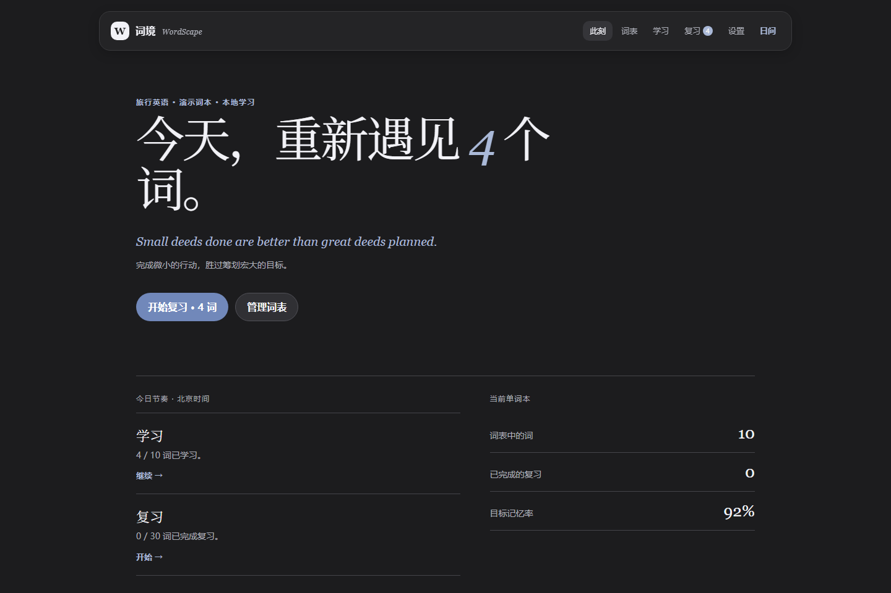
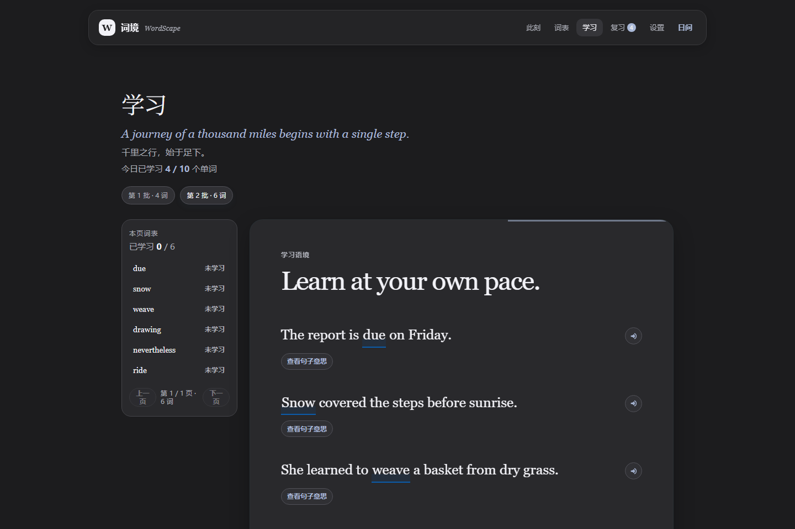
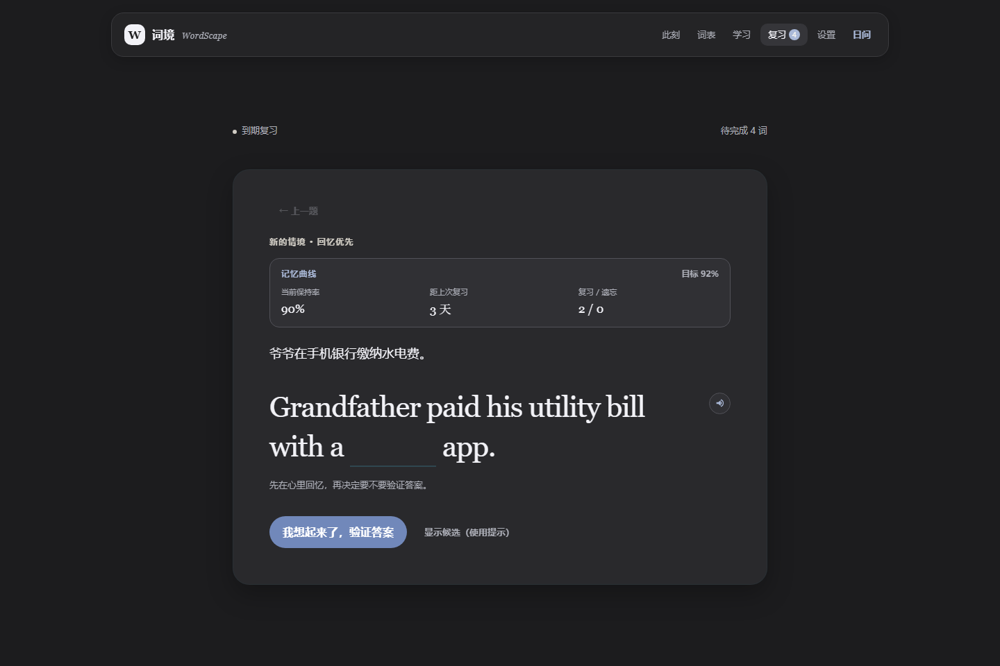

<div align="center">

# 词境·WordScape

### 在语境中认识单词，在间隔中把它留住。

_A local-first, fully open-source English learning space._

`离线词典` · `语境学习` · `FSRS 复习` · `独立记忆表` · `PWA 加密同步`

</div>

> “What we learn with pleasure, we never forget.”
> 愉悦中学到的东西，永远不会忘记。

<p align="center">
  
</p>

## 词境是什么

词境是一个**运行在自己电脑上**的英语词汇学习工具。你导入单词，它把单词放回完整的英文句子中；你开始复习，它换一个中文情景，让你先回忆，再用英文挖空作答。每一次作答都会成为下一次复习间隔的依据。

它默认不需要账号，学习数据首先保存在当前设备。需要多设备连续学习时，可选择启用加密云同步：同步密钥只保留在设备端，云端只保存加密后的数据；不启用时，词表和学习进度不会上传。

## 一行安装（Windows）

先安装开源的 [Node.js 20+](https://nodejs.org/)，然后打开 PowerShell，粘贴并运行这一行：

```powershell
irm https://raw.githubusercontent.com/weleuther900-arch/cijing-WordScape/main/install.ps1 | iex
```

它会自动下载项目、安装依赖、生成离线词典、创建名为“词境”的桌面图标并打开网站。以后只需双击桌面图标，无需输入网址、打开终端或安装 Git。

> 安装位置为当前 Windows 用户的本地应用数据目录；学习数据同样只保存在那里。再次运行这条命令只会打开已有的词境，不会覆盖你的词本或记录。

如果不想使用一行安装，也可以下载 GitHub 的 ZIP，解压后双击 `词境/start.cmd`。首次启动会完成依赖安装和离线词典准备。

## 学习方式

| 阶段 | 体验 | 记录什么 |
| --- | --- | --- |
| 导入 | 粘贴单词，或读取 TXT、PDF、Word、Excel（`.xlsx` / `.xlsm`） | 仅提取英文单词；原始文件不会保存。 |
| 初学 | 英文例句、按需显示句意；点击单词或句意即可朗读英文 | 侧栏会标记已学习与未学习的词。 |
| 回忆 | 中文新情景 + 英文挖空；可先在心里作答，再验证候选 | 错误选项与正确选项显示词性、句中义项和朗读。 |
| 巩固 | FSRS 根据答对、提示后答对、答错等情况计算下次间隔 | 显示当前保持率、距上次复习和下一次复习日期。 |
| 记忆 | 单词本内独立的 First / Day 1 / Day 2 / Day 4 / Day 7 / Day 15 / Day 30 记忆表，支持背诵与默写 | 圆点勾选、释义隐藏与默写拼写核对；不改变 FSRS。 |

<p align="center">
  
  
</p>

## 为长期复习而做

- **真正融入复习的记忆曲线**：不是单独的图表。每道题都会按照 FSRS 计算稳定度、当前保持率和下一次间隔；答错会更快回来，直接答对会更晚出现。
- **一个词本，一套进度**：可以新建、切换、归档或删除本地单词本；切换词本后学习、复习、错词库、日历记录和独立记忆表都会同步切换。
- **看得见的积累**：错词库会统计错误次数；已掌握词可单独保存或删除；日历保留从开始学习至今的每日学习和复习数量。
- **离线仍有释义**：首次安装会根据 MIT 许可的 ECDICT 生成本地索引。之后即使断网，也可以展示中文释义、词性与音标。
- **设备原生英语朗读**：轻点单词即调用当前设备的英语系统声音；iPhone/iPad 仅提供 Moira、Samantha、Tessa，电脑保留自身可用声音。声音选择只保存在当前设备，不参与同步。
- **为专注设计**：支持夜间模式、英文朗读、每日北京时区学习计划、每页词表与页内导航。

## 数据、网络与隐私

| 内容 | 位置与处理方式 |
| --- | --- |
| 学习记录 | 默认保存在本地；启用同步后，云端只保存浏览器加密后的学习、复习与独立记忆表数据。 |
| 离线词典 | 本地 `data/offline-dictionary.json`，不会上传。 |
| 英语声音选择 | 只保存在当前设备；系统声音与朗读内容均不会上传或同步。 |
| 导入的文件 | 只在读取时存在于内存中，完成后不会保存。 |
| 本地服务 | Windows 本地运行时只监听 `127.0.0.1`；iOS/PWA 可通过 HTTPS 使用。 |

这两个本地数据文件、依赖目录和构建缓存都已被 `.gitignore` 排除，因此不会进入 GitHub。

## 手动运行与开发

需要 Node.js 20+。克隆或下载源码后，在 `词境` 目录运行：

```powershell
.\start.cmd
```

或手动执行：

```powershell
npm.cmd install
npm.cmd run dictionary:install
npm.cmd start
```

旧版 `.xls` 是已淘汰的二进制格式，请在 Excel 中另存为 `.xlsx` 再导入。

## 开源与致谢
## 换电脑继续开发

本仓库已包含可复现的应用源码、词库与例句资产、部署配置、项目交接日志和开发说明。换电脑后，将仓库克隆到任意工作目录，并在项目根目录执行：

```powershell
git clone https://github.com/weleuther900-arch/cijing-WordScape.git
cd cijing-WordScape\词境
npm.cmd ci
npm.cmd run ios:web:prepare
```

随后可执行 `npm.cmd start` 启动本地版；需要发布 Cloudflare 时，先在新电脑运行 `npx wrangler login`，再按 `cloudflare/README.md` 操作。使用 Codex 时直接打开仓库根目录，`AGENTS.md` 与 `项目一级日志.md` 会提供项目协作约束和简短交接记录。

个人学习记录（`词境/data/`）与本机密钥（`词境/.env.local`）不会上传到公开仓库；如需迁移学习进度，请在应用“设置 → 数据备份”导出后，手动复制并恢复到新设备。


项目以 [MIT License](LICENSE) 发布。所有运行时依赖和离线词库均采用可再分发的开源许可证；完整清单见 [第三方开源声明](THIRD_PARTY_NOTICES.md)。

离线英汉词典来自 [ECDICT](https://github.com/skywind3000/ECDICT)，按其 MIT 许可证使用，并固定到可复现的源版本。项目不打包、不抓取、不再分发牛津、剑桥等商业词典内容。

为安静、持续、真正属于自己的学习而做。
